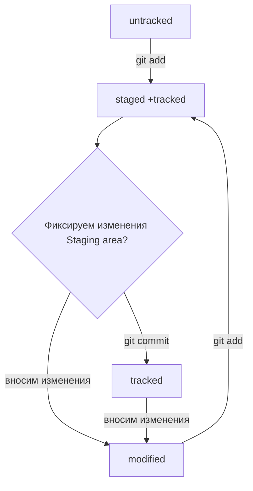

```mermaid
flowchart TD
   A[untracked] -- git add --> B[staged +tracked];
   B --> C{Фиксируем изменения Staging area?};
   C -- git commit --> D[tracked];
   C -- вносим изменения --> E[modified];
   D -- вносим изменения --> E;
   E -- git add --> B;
```
